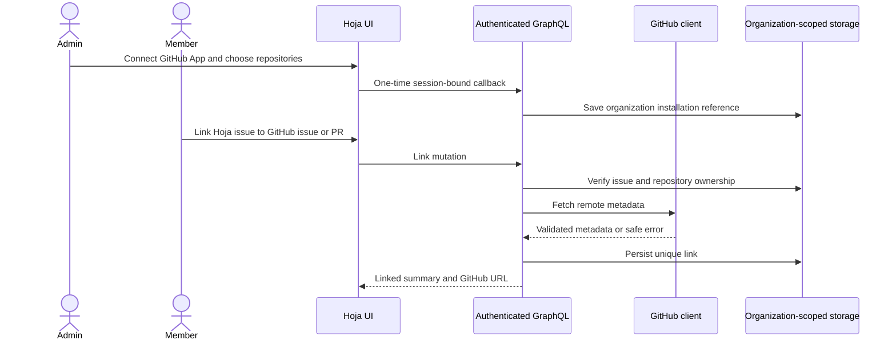

# GitHub integration design

**Status:** proposal; the backend does not currently implement GitHub OAuth,
API access, repository connections, or webhook synchronization.

## Initial scope

Start with organization-admin installation of a GitHub App and explicit
repository allowlisting. Members may link an existing Hoja issue to a GitHub
issue or pull request; the first release should read remote metadata only and
allow unlinking. Do not create or update GitHub issues, automate branches, or
share repository connections across workspaces initially.

## Architecture and invariants

The ASGI app authenticates and provides `org_id` and `user_id` to GraphQL
resolvers (`cliniar_server/app.py`). Resolver persistence belongs in
org-scoped Store/Writer paths (`cliniar_server/resolvers.py`,
`cliniar_server/store.py`, `cliniar_server/writer.py`); SQLAlchemy Core tables
and revisions are in `cliniar_server/db.py`. Reuse these boundaries rather
than trusting a client-provided organization ID.

Add a server-side callback with unpredictable, short-lived, one-use state bound
to the initiating session. Store an installation reference and encrypted
credential or secret-manager reference, never plaintext tokens in ordinary
tables, logs, GraphQL responses, or browser storage. A separate GitHub client
should use bounded timeouts, verified TLS, response validation, safe-read-only
retries, and redacted errors.

Persist installation/repository records and issue-link records with explicit
organization ownership, uniqueness for repository + remote number + object
kind, and checks that linked Hoja issue and repository belong to the current
organization. Fetch and validate the remote object before opening the short DB
write transaction. On failure, do not create a link. Disconnect must revoke
local access without deleting Hoja issues.

## Failure handling and staged delivery

Reject expired/replayed authorization state, duplicate links, and cross-tenant
IDs. A remote 404/403 must not disclose another tenant's object. Treat 401/403
as reauthorization-required, and rate limits/timeouts as bounded retryable
read failures. Do not hold DB transactions open during network calls.

Before implementation, decide GitHub App permissions, GitHub Enterprise
support, secret storage/rotation, who may connect/link/unlink, and stale-link
behavior. Then add a migration and tenant-isolation E2E coverage, client and
callback, GraphQL link/unlink operations, and issue-detail UI. Test callback
state replay, permission revocation, duplicate links, cross-tenant denial,
rate limits and redaction using disposable local fixtures; do not infer live
GitHub behavior from this proposal.
