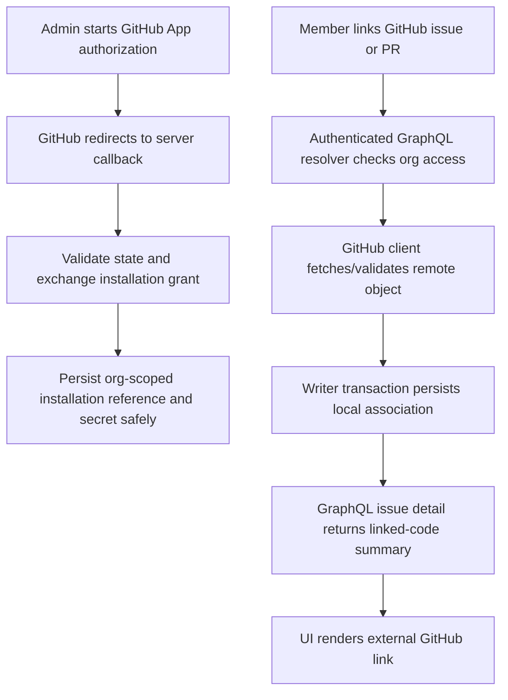

# GitHub integration: implementation plan

## Purpose and scope

Plan a future, optional GitHub integration for the self-hosted Hoja/Cliniar
workspace: associate work items with GitHub repositories, issues, and pull
requests, and show useful linked-code context in the workspace. This document
is a proposal, not a description of shipped functionality. Repository
inspection found no GitHub OAuth callback, webhook receiver, GitHub API client,
or GitHub-specific persisted connection in the current server. The GraphQL
schema summary contains some Linear-compatible GitHub-named fields and
mutations; those are compatibility surface, not evidence of a working GitHub
service. Do not infer integration capability from those names.

## Existing architecture to build on

- The ASGI application in `cliniar_server/app.py` authenticates requests,
  creates a request context containing `store`, `writer`, `org_id`, and
  `user_id`, then invokes the Ariadne GraphQL schema. Browser sessions and API
  tokens are existing auth mechanisms; there is no OAuth provider flow here.
- `cliniar_server/resolvers.py` maps GraphQL operations to storage and writer
  calls. Its `_ctx` helper is currently the boundary for extracting the
  org-scoped store/writer and authenticated identity.
- `cliniar_server/store.py` provides org-scoped data access and serializes
  responses in the Linear-compatible camelCase shape. `cliniar_server/db.py`
  defines SQLAlchemy Core tables and ordered schema revisions. `writer.py`
  handles transactional domain writes.
- The backend is designed for SQLite or PostgreSQL, and the project README
  describes the GraphQL backend contract and tenant isolation. Reuse those
  seams rather than introducing a parallel web app or direct resolver SQL.

## Proposed user-visible scope

Start with repository connections and explicit linking, not event-driven
automation:

1. An organization administrator connects a GitHub App installation (preferred
   over a user PAT) and selects which repositories are available to that
   organization.
2. An authorized workspace member links an existing GitHub issue or pull
   request to a Hoja issue. The issue detail shows provider, repository,
   number/title, state, URL, and last-synced time; links open GitHub.
3. Members can remove a link. Disconnecting an installation removes access
   and credentials without deleting Hoja issues.

Do not scope initial delivery to write operations on GitHub, creating GitHub
issues/PRs, branch automation, webhook-driven live status, or cross-workspace
sharing. Confirm repository visibility and administrator/member permission
semantics before implementation.

## Proposed architecture and data flow

The callback and GitHub API client are proposed new components, not existing
interfaces. Keep network calls outside database transactions: validate/fetch
the remote object first, then persist the association in a short `Writer`
transaction. All GraphQL reads and mutations must remain scoped to the
authenticated `org_id`. Never trust an organization ID supplied by the client
as authorization.

## Suggested incremental delivery

### Phase 0 — decisions and threat model

- Choose GitHub App installation auth, callback URL/configuration, required
  scopes/permissions, supported GitHub Enterprise Server policy, and secret
  storage mechanism. The repository currently establishes none of these.
- Define who can connect/disconnect installations and who can link/unlink
  remote items; determine whether installation/repository access is shared by
  the whole organization.
- Define uniqueness/idempotency (provider + repository + remote number),
  removal semantics, rate-limit handling, and what local UI says when remote
  access is revoked or GitHub is unavailable.

### Phase 1 — schema and read-only linking

- Add migration-backed, organization-owned installation/repository records and
  a link table targeting existing issue IDs. Store only the minimum provider
  identifiers and encrypted credentials/secret references; never persist
  plaintext installation tokens in ordinary tables or logs.
- Add a narrowly-scoped GitHub client with explicit timeouts, bounded retries
  for safe reads, response validation, and redacted errors. Keep it separate
  from the Linear GraphQL client.
- Add authenticated GraphQL operations and resolver/store/writer paths for
  listing authorized repositories, linking/unlinking an existing remote
  issue/PR, and reading linked summaries. Preserve tenant isolation and
  reject cross-org issue/repository references.
- Add UI affordances in issue detail and an organization integration settings
  surface; existing frontend currently has a single `frontend/src/main.tsx`
  entry point, so locate the relevant routed components before implementation.

### Phase 2 — synchronization only after policy is settled

- Decide whether to use webhooks. If enabled, verify the GitHub signature over
  the raw request body before parsing, make delivery handling idempotent, and
  persist delivery IDs before acknowledging accepted work.
- Treat webhooks as hints to refresh validated remote state, not authority to
  bypass tenant/repository authorization. Define retry/dead-letter and stale
  status behavior. These mechanisms do not currently exist in the app.
- Add installation removal/revocation handling and an explicit refresh path
  that remains useful when webhook delivery is missed.

## Security and operational acceptance criteria

- A connection and every linked object are inaccessible from another
  organization, including when IDs are guessed or copied between tenants.
- OAuth state is unpredictable, single-use, bound to the initiating session,
  and expires. Callback errors leave no partially active installation.
- Credentials are encrypted at rest or held in an approved secret manager;
  logs, GraphQL errors, diagnostics, and UI never expose credentials.
- Remote failures, revoked permissions, rate limits, and malformed payloads
  produce actionable but non-secret errors and do not corrupt local data.
- Migrations run on both supported database modes. End-to-end verification
  covers connect/callback, repository selection, link/read/unlink, cross-tenant
  denial, revoked access, and failure recovery through user-visible flows.

## Existing documentation and evidence

This plan deliberately does not repeat server setup/deployment or the
Linear-compatible GraphQL domain contract. See [backend overview](../cliniar_server/README.md)
for current endpoints, authentication, tenant isolation, storage, and
architecture, and [deployment guide](DEPLOYMENT.md) for operational setup.
`AGENTS.md` documents repository change, security, and verification conventions.

Architecture evidence inspected while drafting:

- `cliniar_server/app.py`: `create_app`, `_auth`, GraphQL request context, and
  route registration establish authentication/context boundaries.
- `cliniar_server/resolvers.py`: `_ctx` and resolver bindings establish the
  GraphQL-to-store/writer seam and org/user context.
- `cliniar_server/store.py`: `Store.resolve_token` and module/class contract
  establish existing token resolution and storage responsibility.
- `cliniar_server/db.py`: SQLAlchemy Core tables and `CURRENT_SCHEMA_REVISION`
  establish migration-backed persistence structure.
- `cliniar_server/writer.py`: writer module contract and transactional write
  paths establish the domain mutation seam.
- `cliniar_server/README.md`: “What it implements”, “Multi-tenancy”,
  “Storage”, and “Architecture” describe the current backend contract.
- `docs/DESIGN.md`: documents existing compatibility/schema context; it does
  not prescribe a GitHub service implementation.

Before implementation, re-inspect these sources because this plan records the
architecture as observed on 2026-10-06, not a permanent interface guarantee.
