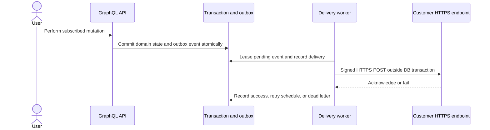

# Webhook support design

**Status:** proposal; no outbound webhook dispatcher is implemented.

## Delivery contract

Support outbound tenant-scoped event delivery to administrator-configured
HTTPS endpoints. Endpoint management must derive organization identity from
authenticated context. Require endpoint verification, allowlisted event
types, secret rotation, and delivery history. Do not implement inbound third
party hooks in this initial scope.

Deliver JSON with stable event ID/type/time/organization/data fields, signed
over timestamp plus exact request body using HMAC-SHA256. Use constant-time
signature comparison. Show a newly created secret once only. Store it
encrypted or via a secret manager, never in logs or delivery listings.

## Outbox and safe network behavior

Record domain change and outbox event atomically in the same database
transaction. A separate dispatcher claims bounded batches with expiring leases,
records per-endpoint attempts, and sends outside the transaction. Use unique
event/endpoint delivery keys, but promise at-least-once delivery: receivers
must deduplicate event IDs. Retry timeouts, 408, 429 and 5xx with capped
exponential backoff/jitter; terminal 4xx and exhaustion become visible
dead-letter records with manual retry.

Reject localhost, private, link-local, reserved and IPv4-mapped IPv6 targets.
Resolve and validate DNS at connection time, block unsafe redirects or
revalidate every target, impose timeouts/body limits/concurrency limits, and
use deployment egress controls as defense in depth. Persist sanitized error
class/status/duration, not response bodies or credentials.

## Implementation gates

Decide event taxonomy/payload versioning, secret management, worker scheduling,
retention, quotas and admin roles before implementation. Add migrations and
outbox writes only for mutation paths that are proven transactional. E2E
acceptance should cover endpoint verify/configure, signed event receipt,
readable delivery history and manual retry, cross-tenant denial, timeout/429/
5xx and terminal 4xx, lease recovery, duplicate receipt handling, SSRF/DNS/
redirect rejection, and secret/payload redaction. Keep delivery disabled by
default until these flows pass; do not claim exactly-once delivery.
